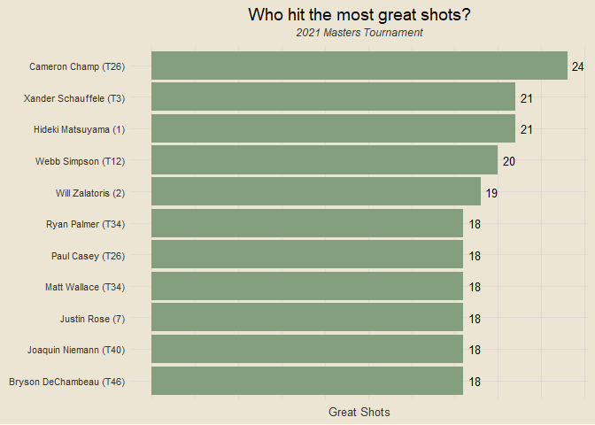

the masteRs
================

Data:
<a href="https://datagolf.com/raw-data-archive" target="_blank">Raw Data
Archive</a> via
<a href="https://datagolf.com/" target="_blank">datagolf.com</a>

------------------------------------------------------------------------

### Setup

<details>
<summary>
View Code
</summary>

``` r
library(tidyverse)
library(janitor)
library(tvthemes)
library(plotly)

theme_custom = theme_avatar() +
  theme(plot.title = element_text(hjust = 0.5),
        plot.subtitle = element_text(hjust = 0.5, size = 9, vjust = 2.5, face = "italic"),
        plot.caption = element_text(face = "italic"),
        panel.grid.major = element_line(linewidth = 0.5, colour = "#DFDAD1"),
        panel.grid.minor = element_line(linewidth = 0.5, colour = "#DFDAD1"))

theme_set(theme_custom)
custom_red = "#DA8B8B"
custom_green = "#839F7D"
```

</details>

### Data Import

<details>
<summary>
View Code
</summary>

``` r
# changing player name to be (first + last) instead of (last, first)
df = read_csv("data/masters_data_2021.csv", show_col_types = F) |>
  separate(player_name, into = c("last_name", "first_name"), sep = ",") |>
  mutate(player_name = paste(first_name, last_name)) |>
  select(1:5, 31, 8:30)

paste0("Data dimensions: ", nrow(df), " rows, ", ncol(df), " columns")
```

</details>

    ## [1] "Data dimensions: 284 rows, 29 columns"

### Scoring Gaps

Which players had the largest difference between their best and worst
scores for the tournament?

<details>
<summary>
View Code
</summary>

``` r
min_max_rounds = df |>
  group_by(player_name) |>
  summarise(min_round = min(round_score),
            max_round = max(round_score)) |>
  mutate(min_max_diff = max_round - min_round)

min_max_rounds |>
  slice_max(min_max_diff, n = 5) |>
  pivot_longer(c(min_round, max_round), names_to = "min_max", values_to = "score") |>
  ggplot(aes(reorder(player_name, -min_max_diff), score)) +
  geom_col(aes(fill = min_max), position = "dodge", show.legend = F) +
  geom_text(aes(label = score, group = min_max), position = position_dodge2(width = 0.9), vjust = -0.5, size = 3.5) +
  scale_fill_manual(values = c(custom_red, custom_green)) +
  labs(x = NULL, y = "Score",
       title = "Who had the biggest difference in their best and worst rounds?",
       subtitle = "2021 Masters Tournament") +
  theme(axis.text.y = element_blank())
```

</details>

<!-- -->

**Plot Notes**

- Bernd Wiesberger shot 78 in round 4 and 66 in round 2
- Francesco Molinari shot 81 in round 4 and 69 in round 3
- Carlos Ortiz shot 82 in round 1 and 71 in round 2 (missed cut)
- Joe Long shot 82 in round 1 and 72 in round 2 (missed cut)
- Hudson Swafford shot 83 in round 2 and 73 in round 1 (missed cut)

------------------------------------------------------------------------

### Great Shots

Who hit the most great shots?

<details>
<summary>
View Code
</summary>

``` r
# cor_df = df |>
#   filter(!is.na(great_shots) & !is.na(round_score))
# 
# round(cor(cor_df$great_shots, cor_df$round_score), 3)

df |>
  filter(!is.na(great_shots)) |>
  group_by(player_name, fin_text) |>
  summarise(great_shots = sum(great_shots),
            .groups = "drop") |>
  slice_max(great_shots, n = 10) |>
  mutate(p_name = paste0(player_name, " (", fin_text, ")")) |>
  ggplot(aes(reorder(p_name, great_shots), great_shots)) +
  geom_col(fill = custom_green) +
  geom_text(aes(label = great_shots), size = 3.5, hjust = -0.4) +
  coord_flip() +
  labs(x = NULL, y = "Great Shots",
       title = "Who hit the most great shots?",
       subtitle = "2021 Masters Tournament") +
  theme(axis.text.x = element_blank())
```

</details>

<!-- -->

**Plot Note**: The number of great shots a player hit had a -0.367
correlation coefficient with that player’s round score, meaning that as
players hit more great shots, their score decreased - just as we’d
expect!

------------------------------------------------------------------------

### Poor Shots

Who hit the most poor shots?

<details>
<summary>
View Code
</summary>

``` r
# cor_df = df |>
#   filter(!is.na(poor_shots) & !is.na(round_score))
# 
# round(cor(cor_df$poor_shots, cor_df$round_score), 3)

df |>
  filter(!is.na(poor_shots)) |>
  group_by(player_name, fin_text) |>
  summarise(poor_shots = sum(poor_shots),
            .groups = "drop") |>
  slice_max(poor_shots, n = 10) |>
  mutate(p_name = paste0(player_name, " (", fin_text, ")")) |>
  ggplot(aes(reorder(p_name, poor_shots), poor_shots)) +
  geom_col(fill = custom_red) +
  geom_text(aes(label = poor_shots), size = 3.5, hjust = -0.4) +
  coord_flip() +
  labs(x = NULL, y = "Poor Shots",
       title = "Who hit the most poor shots?",
       subtitle = "2021 Masters Tournament") +
  theme(axis.text.x = element_blank())
```

</details>

<!-- -->

**Plot Note**: The number of poor shots a player hit had a 0.592
correlation coefficient with that player’s round score, meaning that as
players hit more poor shots, their score increased - this is compared to
a -0.367 correlation coefficient between great shots and round score, so
the number of poor shots a player hit in a round was more impactful to
their score than the number of great shots was.

------------------------------------------------------------------------

### Great and Poor Shots

What is the relationship between great and poor shots?

<details>
<summary>
View Code
</summary>

``` r
made_missed_cut = df |>
  filter(!is.na(great_shots) & !is.na(poor_shots)) |>
  count(player_name) |>
  mutate(made_cut = ifelse(n == 4, "Made Cut", "Missed Cut"))

# cor_df = df |>
#   filter(!is.na(great_shots) & !is.na(poor_shots)) |>
#   group_by(player_name) |>
#   summarise(great = sum(great_shots),
#             poor = sum(poor_shots),
#             .groups = "drop")
# 
# round(cor(cor_df$great, cor_df$poor), 3)

df |>
  filter(!is.na(great_shots) & !is.na(poor_shots)) |>
  inner_join(made_missed_cut, by = "player_name") |>
  group_by(player_name, made_cut) |>
  summarise(great = sum(great_shots),
            poor = sum(poor_shots),
            .groups = "drop") |>
  ggplot(aes(great, poor)) +
  geom_point(aes(col = made_cut), size = 4) +
  geom_abline(linetype = "dashed", alpha = 0.5) +
  # geom_line(stat = "smooth", formula = y ~ x, method = "lm", linetype = "dashed", alpha = 0.5) +
  scale_color_manual(values = c(custom_green, custom_red)) +
  labs(x = "Great Shots", y = "Poor Shots", col = NULL,
       title = "Scatterplot of Great and Poor Shots",
       subtitle = "2021 Masters Tournament") +
  theme(legend.position = "right") +
  scale_x_continuous(breaks = seq(0, 50, by = 2)) +
  scale_y_continuous(breaks = seq(0, 50, by = 2))
```

</details>

<!-- -->

**Plot Note**: Over the course of the tournament, there is a positive
correlation of 0.583 between the number of great shots a player hit and
the number of poor shots a player hit. In the plot, the dashed line
represents the points where the number of great shots is equal to the
number of poor shots a player hit - ideally, players want to be below
this line, indicating they hit more great shots than poor shots.

------------------------------------------------------------------------

### Great Shots v Poor Shots

Which players had the biggest difference in great and poor shots, in
either direction?

<details>
<summary>
View Code
</summary>

``` r
n_threshold = 6

df |>
  filter(!is.na(great_shots) & !is.na(poor_shots)) |>
  group_by(player_name, fin_text) |>
  summarise(great = sum(great_shots),
            poor = sum(poor_shots),
            .groups = "drop") |>
  mutate(diff = great - poor) |>
  slice_max(diff, n = n_threshold) |>
  rbind(df |>
  filter(!is.na(great_shots) & !is.na(poor_shots)) |>
  group_by(player_name, fin_text) |>
  summarise(great = sum(great_shots),
            poor = sum(poor_shots),
            .groups = "drop") |>
  mutate(diff = great - poor) |>
  slice_min(diff, n = n_threshold)) |>
  mutate(diff_col = ifelse(diff > 0, "good", "bad"),
         pos_lab = ifelse(diff > 0, diff, ""),
         neg_lab = ifelse(diff < 0, diff, ""),
         p_name = paste0(player_name, " (", fin_text, ")")) |>
  ggplot(aes(reorder(p_name, diff), diff)) +
  geom_col(aes(fill = diff_col), show.legend = F) +
  geom_text(aes(label = pos_lab), size = 3.5, hjust = 1.5) +
  geom_text(aes(label = neg_lab), size = 3.5, hjust = -0.4) +
  coord_flip() +
  scale_fill_manual(values = c(custom_red, custom_green)) +
  labs(x = NULL, y = "Great Shots - Poor Shots",
       title = "Biggest Differences Between Great and Poor Shots",
       subtitle = "2021 Masters Tournament") +
  scale_y_continuous(breaks = seq(-15, 15, by = 3))
```

</details>

<!-- -->

------------------------------------------------------------------------

### Impactful Shots by Round

<details>
<summary>
View Code
</summary>

``` r
df |>
  filter(!is.na(great_shots) & !is.na(poor_shots) & !is.na(round_score)) |>
  inner_join(df |>
  filter(!is.na(great_shots) & !is.na(poor_shots) & !is.na(round_score)) |>
  group_by(player_name, round_num) |>
  summarise(great = sum(great_shots),
            poor = sum(poor_shots),
            impactful = sum(great_shots) + sum(poor_shots),
            .groups = "drop"), by = c("player_name", "round_num")) |>
  mutate(great_prop = great / impactful,
         round_num = paste0("Round ", round_num)) |>
  ggplot(aes(impactful, round_score)) +
  geom_point() +
  geom_smooth(formula = y ~ x, method = "lm", se = F, col = "springgreen4") +
  geom_hline(yintercept = 72, alpha = 0.15) +
  facet_wrap(vars(round_num)) +
  labs(x = "Impactful Shots", y = "Round Score",
       title = "Impactful Shots by Round",
       subtitle = "2021 Masters Tournament") +
  scale_x_continuous(breaks = seq(0, 20, by = 2)) +
  scale_y_continuous(breaks = seq(60, 90, by = 4))
```

</details>

<!-- -->

**Plot Note**: I am defining an impactful shot as one that has either a
great or poor outcome (as determined by the data source). One way of
interpreting this may also be considering these as high-risk shots -
shots that are risky and can either turn out great or turn out poorly.
This may not necessarily be the case for each great or poor shot, but is
how I am tracking it with the data at hand. With this interpretation,
round three is called moving day for a reason - it is the only round
where the number of impactful shots has a negative relationship with
that player’s score. The relationship is also notably more positive in
rounds two and four, which I suspect may be due to course setup or some
players hitting higher-risk shots in attempt to make the cut or improve
their finishing position.

------------------------------------------------------------------------

### Scoring by Round and Time of Day (IN PROGRESS)

``` r
df |>
  inner_join(df |>
  distinct(round_num, teetime) |>
  group_by(round_num) |>
  mutate(round_group_num = rank(teetime)) |>
  arrange(round_num, teetime), by = c("round_num", "teetime")) |>
  group_by(round_num, teetime) |>
  summarise(round_score = sum(round_score),
            .groups = "drop")
```

    ## # A tibble: 114 × 3
    ##    round_num teetime round_score
    ##        <dbl> <time>        <dbl>
    ##  1         1 08:00           145
    ##  2         1 08:12           231
    ##  3         1 08:24           226
    ##  4         1 08:36           222
    ##  5         1 08:48           226
    ##  6         1 09:00           216
    ##  7         1 09:12           218
    ##  8         1 09:24           223
    ##  9         1 09:36           225
    ## 10         1 09:48           218
    ## # ℹ 104 more rows
